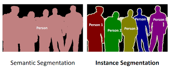
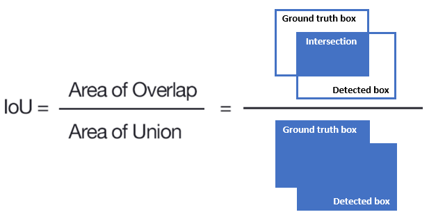
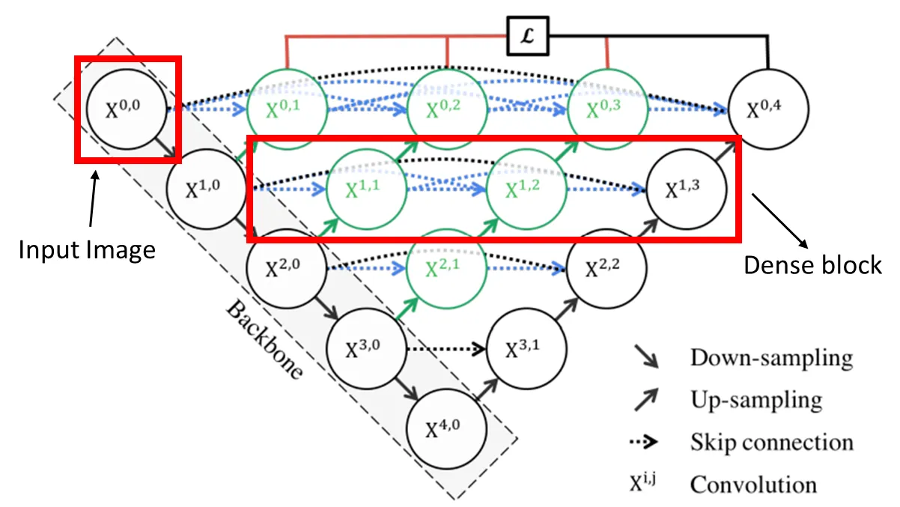
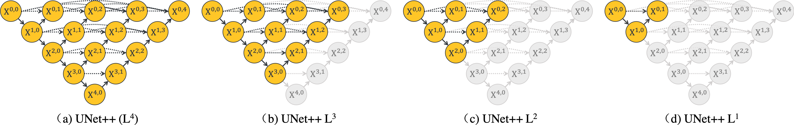
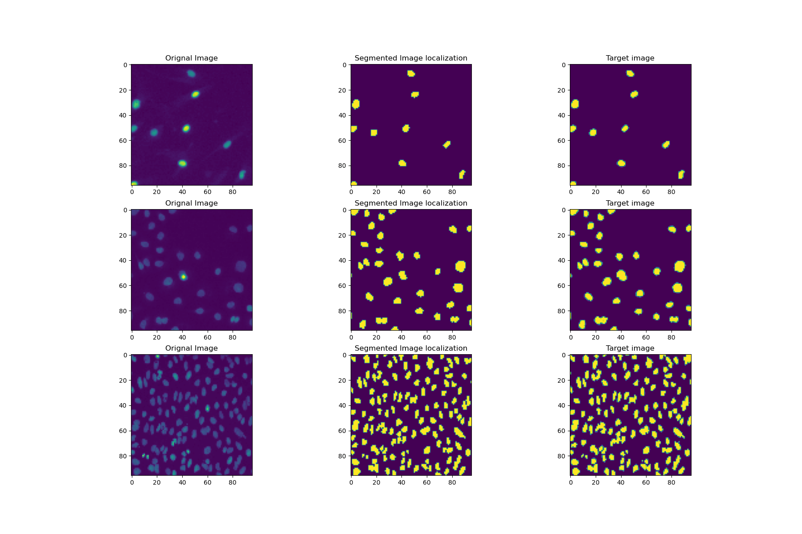

# Image Segmentation with U-Net and its Variant

## 1. Image Segmentation Basics
- **Definition**: Pixel-by-pixel classification to identify specific objects.
- **Types**:
  - **Semantic Segmentation**: Labels pixels to categories without differentiating instances.
  - **Instance Segmentation**: Distinguishes between individual objects within the same category.



## 2. Loss Functions
### Pixel-wise Cross-Entropy Loss
- **Formula**:
```math
L_{CE} = -\sum_{i} y_i \log(\hat{y}_i)
```
- **Formula for Binary Cross-Entropy (BCE) Loss**:

```math
L_{BCE} = - y \log(\hat{p}) - (1 - y) \log(1 - \hat{p})
```

### Focal Loss
Focal Loss addresses the issue of class imbalance and sample difficulty by down-weighting the contribution of well-classified (easy) samples and focusing more on hard-to-classify examples.

#### Formula for Binary Classification:
```math
L_{FL} = - \alpha (1 - \hat{p})^\gamma y \log(\hat{p}) - (1 - \alpha) \hat{p}^\gamma (1 - y) \log(1 - \hat{p})
```

Where:
- $\hat{p}$ is the predicted probability for the positive class.
- $y$ is the ground truth label y = 1 for positive class, y = 0 for negative class.
- $\alpha$ is the balancing factor for class imbalance:
```math
\alpha = \frac{N_{neg}}{N_{pos} + N_{neg}}, \quad 1 - \alpha = \frac{N_{pos}}{N_{pos} + N_{neg}}
```
- $\gamma$ is the focusing parameter, often set to 2.

#### Key Benefits:
- **Focus on Hard Examples**: By modulating the loss with $(1 - \hat{p})^\gamma\$, focal loss prioritizes difficult samples.
- **Handles Class Imbalance**: $\alpha$ allows adjusting the contribution of positive and negative samples, improving performance in imbalanced datasets.


## 3. Evaluation Metrics
### IoU (Intersection over Union)
- **Formula**:
```math
IoU = \frac{TP}{TP + FP + FN}
```
- **Usage**: Measures overlap between prediction and ground truth.
<div align="center">
  
</div>

### Mean IoU (mIoU)
- **Definition**: Average IoU across all classes:
```math
mIoU = \frac{1}{N} \sum_{i=1}^{N} IoU_i
```

## 4. Segmentation Architectures
### U-Net
- **Structure**: Encoder-decoder with skip connections.
- **Features**: Effective for medical imaging and other tasks.
<div align="center">
  
</div>

### U-Net++
- **Enhancement**: Richer feature fusion akin to DenseNet.
- **Deep Supervision**:
  - Multiple intermediate outputs.
- **Benefits**: Facilitates easier pruning with intermediate supervision.
<div align="center">
  
</div>
<div align="center">
  
</div>

## 5. Segmentation Result Using U-Net++
<div align="center">
  
</div>


